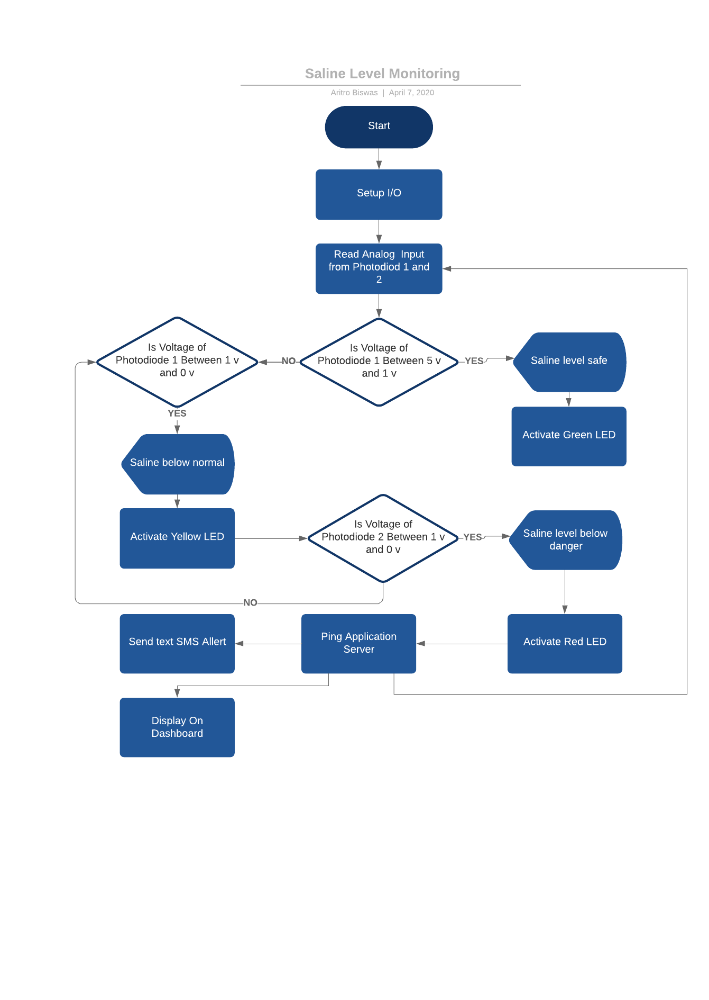

# Youtube Link(Eyantra)
https://www.youtube.com/watch?v=bnveONTrvgo&feature=youtu.be&ab_channel=e-Yantra

# SLM
Saline Level Monitoring System

# Clone
git clone https://github.com/aritro-biswas/slm.git --recursive

# Description
In hospitals there is a major issue with the saline bottle monitoring as the nurses have to check the saline bottles time to time, This increases the exposure time of the nurses to the patients which increases the chanses of the nurses getting infected.

This IOT based solution attempts to solve the problem by deploying modular device that can be attached to any Saline bottle for monitoring the liquid level. Once the level drops under safe threshold the flow is clamped and an alert message is sent to the nurse.

# Hardware Requirments

1.Arduino

2.ESP8266 Wifi Module

3.Clamp

4.Photodiodes x2

5.BLUE LED x2

6.GREEN,YELLOW,RED LED

# Software Requirments(For Linux Only)

1.npm

2.React Native

3.mongodb

4.node

5.express

# Process Flow

